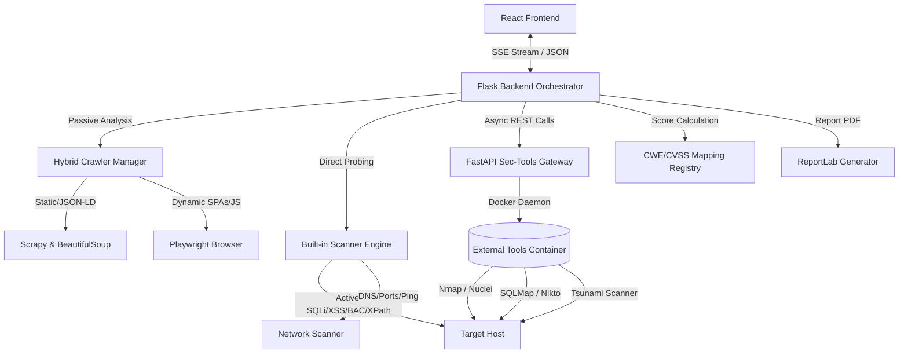

# 🦅 Garud Vulnerability Scanner & Reconnaissance Engine

[](https://www.python.org/)
[](https://react.dev/)
[](https://www.docker.com/)

Garud is an automated security orchestration platform designed to streamline web application auditing, network reconnaissance, and vulnerability management. By unifying custom active/passive scanning modules, hybrid crawling engines (capable of mapping static pages and dynamic Single Page Applications), and containerized industry-standard scanner daemons, Garud provides a centralized dashboard for real-time security assessment. 

Scan results are processed asynchronously and streamed via a unified Server-Sent Events (SSE) channel, mapping vulnerabilities directly to Common Weakness Enumerations (CWE) and calculating dynamic Common Vulnerability Scoring System (CVSS) metrics. The frontend features an interactive, force-directed site topology map alongside download capability for executive PDF reports.

---

## ⚠️ Ethical & Educational Disclaimer

> [!WARNING]
> Garud is engineered strictly for authorized security auditing, penetration testing, vulnerability research, and educational purposes. **Usage of this tool to scan networks or web applications without explicit, written permission from the target owner is illegal.** The developers assume no liability for misuse, collateral damage, or regulatory violations incurred by utilizing this software.

---

## 🎓 Educational Overview & Purpose

Many contemporary security tools operate either as black-box CLI utilities or enterprise-scale platforms with opaque scoring models. Garud bridges this gap by acting as an educational tool as much as an operational scanner. It is designed to expose the *mechanisms* of security flaws and trace them back to core design weaknesses. 

Every identified vulnerability is linked to its corresponding **CWE entry** (e.g., CWE-89 for SQL Injection, CWE-79 for XSS). Rather than simply reporting that an endpoint is vulnerable, Garud maps out:
- **The Attack Vector:** The specific parameter, header, or routing path used to trigger the issue.
- **The Evidence:** Raw response payloads, reflective strings, or cryptographic handshakes proving the vulnerability's existence.
- **The Severity Reasoning:** How the CVSS base score was derived from metrics like confidentiality, integrity, and availability impacts.
- **The Remediation Path:** Actionable code snippets and configuration rules (e.g., specific Nginx configuration directives or secure coding practices) to help developers patch the underlying weakness.

---

## ✨ Key Features

- **🔄 Multi-Stage SSE Scan Pipeline:** Real-time state synchronization across 5 scanning checkpoints (Reconnaissance ➔ Surface Analysis ➔ Vulnerability Scanning ➔ External Tools ➔ Report Generation).
- **🕸️ Hybrid Crawling Engine:** Integrates Scrapy for high-performance static parsing, Playwright for headless browser interaction with JavaScript-heavy SPAs, and BeautifulSoup for target metadata extraction.
- **🛡️ Built-in Specialized Scanners:** Active in-memory testing suites for:
  - SQL Injection (Boolean-based, Error-based)
  - Cross-Site Scripting (Reflected, Stored, DOM, and Out-of-Band Blind XSS)
  - Broken Access Control & IDOR (Verb tampering, Path segment fuzzing, Privilege parameter tampering)
  - Server-Side Request Forgery (OAST verification via localized collaborator endpoints)
  - Cryptographic & Data Integrity Failures (Weak TLS ciphers, expired certificates, missing Subresource Integrity hashes)
  - XPath and Path Traversal vulnerabilities
- **🐳 Containerized Tool Gateway:** Asynchronous worker pipeline coordinating heavier external tools (Nikto, SQLMap, Nuclei, Tsunami, and Nmap) via Docker Compose, parsing their outputs into a standardized schema.
- **📊 Interactive Network Topology Graph:** Renders crawled endpoints, folder structures, and sensitive nodes in real time using a custom force-directed graph.
- **📄 Executive PDF Generation:** Creates detailed, production-ready reports containing vulnerability statistics, security grades (A to F), and mitigation procedures.

---

## 🛠️ Technology Stack

- **Frontend:** React, Tailwind CSS, Framer Motion, Force-Graph (Canvas/SVG), Lucide Icons, and Axios.
- **Backend Orchestrator:** Flask (Python), ThreadPoolExecutor, Server-Sent Events (SSE), and ReportLab (PDF generation).
- **Security Tools Gateway:** FastAPI (Python), Asyncio, Docker Daemon, and Subprocess Wrappers.
- **Crawlers:** Playwright (Python), Scrapy, and BeautifulSoup4.
- **Database/Storage:** In-memory TTL Caches for TLS and Outdated Component APIs (OSV / NVD).

---

## ⚙️ System Architecture & Internal Workings

The project utilizes a split-gate microservices model, isolating the main API orchestrator from the heavy resource footprint of third-party scanning tools.



### 1. Checkpoint 1: Reconnaissance
When a scan is initiated, the orchestrator triggers the **Hybrid Crawler Manager** and **Network Scanner** in parallel using Python's `ThreadPoolExecutor`. The crawler traverses the domain, building a link graph, identifying inputs, and extracting form schemas. Concurrently, the network module performs DNS resolution, pings the host to check latency, traces the route, and runs a fast-port check (using Nmap, with a raw socket fallback if Nmap is absent).

### 2. Checkpoint 2: Surface Analysis
Once endpoints are discovered, the platform performs passive audits:
- Analyzing headers for missing defense controls (`CSP`, `HSTS`, `X-Frame-Options`).
- Spotting version-revealing headers (like `X-Powered-By` or `Server`).
- Scanning HTML, JavaScript scripts, and variables for exposed API keys, private tokens, or secrets.
- Cataloging all inputs and action endpoints to compile a comprehensive attack surface.

### 3. Checkpoint 3: Vulnerability Scanning
This phase launches active vulnerability tests. Built-in engines inject payloads into the targets discovered in Phase 2:
- **SQLi/XPath:** Fuzzes parameters using logical operators, escaping characters, and database-specific error indicators.
- **XSS:** Probes endpoints to check for reflected scripts. If reflected, it analyzes context (HTML body, attributes, JS strings) to verify execution path. DOM-based XSS is checked by statically identifying sources (`location.hash`) and sinks (`innerHTML`). Blind XSS uses Out-of-Band (OOB) collaborator servers.
- **BAC:** Checks for parameter tampering (such as altering `?id=1` to `?id=2`), HTTP verb tampering, and header-based bypass tricks (e.g., `X-Original-URL`).
- **Outdated Components:** Detects frontend libraries and queries the Open Source Vulnerability (OSV) API in batches, falling back to the NVD API if necessary, to look up CVE information.

### 4. Checkpoint 4: External Tools Integration
The orchestrator polls the **FastAPI Sec-Tools Gateway** for updates on the background scans running inside containerized tools (such as Nuclei templates or SQLMap). The gateway normalizes these external findings into the platform's core database format.

### 5. Checkpoint 5: Aggregation, CVSS Grading & PDF Generation
The orchestrator aggregates all findings, resolves overlaps, and filters out duplicates. It calculates a unified security score (from 0 to 100) and assigns a grade (A to F) based on penalty weights mapped to CVSS scores. Finally, the **ReportLab** library generates a structured PDF report for download.

---

## 📁 Project Structure

```
Garud-Project/
├── garud-backend/             # Flask Orchestrator & Native Scanners
│   ├── server.py              # Main API and SSE Pipeline Orchestration
│   ├── crawler_manager.py     # Hybrid BeautifulSoup/Playwright Coordinator
│   ├── sqli_scanner.py        # Custom SQLi Detection Module
│   ├── xss_scanner.py         # Custom XSS Detection Module
│   ├── bac_scanner.py         # Custom Broken Access Control Module
│   ├── network_scanner.py     # Port Scanner and DNS Reconnaissance Module
│   ├── report_generator.py    # PDF Exporter using ReportLab
│   └── config.py              # Configuration schemas (Dev, Prod, Test)
├── garud-frontend/            # React Client Application
│   ├── src/
│   │   ├── App.js             # Core UI, SSE client, and Graph Coordinator
│   │   ├── Capabilities.js    # interactive Directory of scanner metrics
│   │   └── index.css          # Styling configurations
│   └── package.json           # Frontend dependency manifest
├── garud-sec-tools/           # FastAPI Wrapper for Containerized Scanners
│   ├── main.py                # Process execution & output parser
│   └── Dockerfile             # Custom tooling runtime container
├── data/
│   └── cwe_reference.json     # Standardized CWE classification cache
├── docker-compose.yml         # Unified service orchestrator configuration
└── README.md                  # System Documentation
```

---

## 🔧 Configuration Details

Configuration parameters are managed through environment variables and modular Python classes. Key configuration paths include:

### `garud-backend/config.py`
Defines operational parameters like request timeouts, max crawler depths, and reporting directories:
```python
class Config:
    SECRET_KEY = os.getenv('SECRET_KEY', 'your-session-key')
    CRAWL_TIMEOUT = 300  # seconds
    MAX_CRAWL_DEPTH = 2
    REPORTS_DIR = os.path.join(os.getcwd(), 'reports')
```

### `docker-compose.yml`
Controls resource allocation limits, network exposure, and JVM heap properties for heavier tools:
```yaml
services:
  garud-sec-tools:
    image: garud-sec-tools:latest
    environment:
      JAVA_OPTS: "-Xms128m -Xmx1536m -XX:+UseG1GC"
      PYTHONUNBUFFERED: "1"
    cap_add:
      - NET_RAW # Required for Nmap raw packet probes
    deploy:
      resources:
        limits:
          cpus: "2"
          memory: 3G
```

---

## 🚀 Installation Steps

### Prerequisites
- **Python:** 3.10 or higher
- **Node.js:** 16.x or higher (npm v8+)
- **Docker & Docker Compose:** Installed and running on your system

### 1. Clone the Repository
```bash
git clone https://github.com/TrashCan-Design/Garud.git
cd Garud
```

### 2. Security Tools Gateway (Docker)
```bash
cd garud-sec-tools
docker build -t garud-sec-tools .
docker run -d -p 8001:8001 garud-sec-tools
```

### 3. Flask Backend Orchestrator

#### 💻 Windows (PowerShell)
```powershell
cd garud-backend
python -m venv venv
.\venv\Scripts\activate
pip install -r requirements.txt
$env:SEC_TOOLS_URL="http://127.0.0.1:8001"
python server.py
```

#### 💻 Windows (Command Prompt)
```cmd
cd garud-backend
python -m venv venv
call venv\Scripts\activate
pip install -r requirements.txt
set SEC_TOOLS_URL=http://127.0.0.1:8001
python server.py
```

#### 🐧 Linux (Bash)
```bash
cd garud-backend
python3 -m venv venv
source venv/bin/activate
pip install -r requirements.txt
playwright install --with-deps chromium
export SEC_TOOLS_URL="http://127.0.0.1:8001"
python server.py
```

### 4. React Frontend
```bash
cd garud-frontend
npm install
npm start
```

---

## 📖 Usage Instructions

1. **Access the Dashboard:** Open `http://localhost:3000` in your web browser.
2. **Select Scan Targets:** Enter a target domain name or IP address (e.g., `http://example.com`) in the scan console.
3. **Monitor Real-Time Progress:** Watch the SSE progress tracker update through the five checkpoints:
   - *Checkpoint 1 (Reconnaissance):* Visualizes ports and latency.
   - *Checkpoint 2 (Surface Analysis):* Lists missing security headers and input fields.
   - *Checkpoint 3 (Active Scans):* Identifies vulnerabilities dynamically.
   - *Checkpoint 4 (External Tools):* Integrates data from tools like SQLMap or Nuclei.
   - *Checkpoint 5 (Final Report):* Displays the final security score and grading summary.
4. **Explore the Network Topology Map:** Interact with the force-directed node graph to explore directories, dynamic pages, and asset relationships.
5. **Download Reports:** Click **Download PDF Report** to export the aggregated findings, CVSS calculations, and mitigation details.

---

## 🤝 Contribution Guidelines

We welcome contributions to the Garud engine. To maintain quality across the codebase:
- **Zero Logic Impact:** Ensure comment refactoring or documentation updates do not modify functional code or scanner logic.
- **Code Standards:** Adhere to PEP 8 standards for Python and ESLint configurations for React.
- **Write Tests:** Include unit tests for any new scanner check or parser wrapper.
- **Submit Pull Requests:** Create descriptive pull requests targeting the `development` branch.

---

## 💖 Acknowledgments

- The creators of the **OWASP Top 10** project for security classifications.
- **Project Discovery** for the Nuclei template scanner framework.
- The **SQLMap** and **Nikto** developer communities.
- The **Google Tsunami Security Scanner** team.
